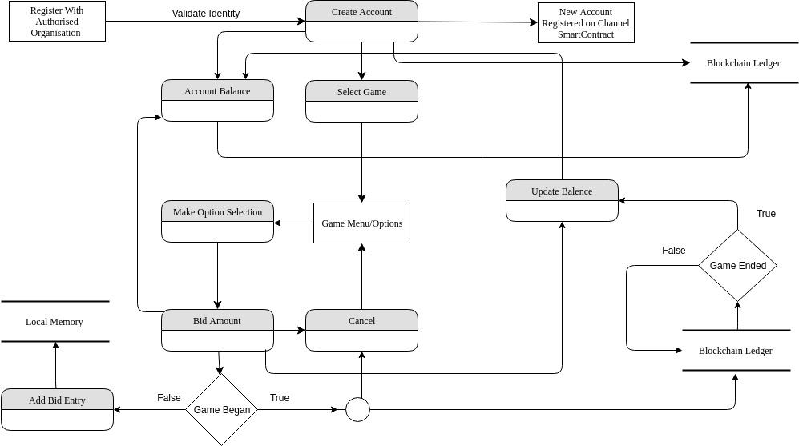

# GamblAR

GamblAR is a decentralized gambling platform which curbs illegal use of black money and creates a transparent platform for regulated exchange of credits. It incorporates government regulations and legalizes the mechanism and streamlines process avoiding all intermediaries. GamblAR provides an augmented interface showcasing various types of events. 

---

### Application Workflow

---

#### Tools/Frameworks Used
* Hyperledger Fabric 
* Fabric-Go-SDK
* Docker - Containerization

#### Languages Used
* Go Lang

#### Steps to execute code [Needs massive improvement, especially introdcution of controllers]
* Install Go Language from the official website, version greater than equal to 1.10 .
* Clone Hyperledger Fabric Repository from GitHub.
* Ensure the git branch points to version Fabric 1.2.
* Get the project source-code from the CD or clone from git repository using `git clone https://github.com/thekaleidoscope/GamblAR.git`.
* Install all required modules using `$ go get all` inside the project repositiory.
* Edit the main.go file to adjust the script to perform required operations like account creation .
* Build the project into a binary using `$ go build` inside the project repository.
* Install Docker and Docker Compose.
* In the project repository navigate to units folder, and pull all  docker images using `$ docker-compose pull`.
* Inside the units folder, Run the docker services using `$ docker-compose -f docker-compose.yaml up`.
* Run the project build using `$ ./GamblAR`.

---

#### Improvements Required
* Introduce scripts to check system environment compartablility.
* Add `gorilla-mux` or a version of it for creating controllers.
* Add the bid distribution  at the end of game.
* Unit-test the project.
  

 